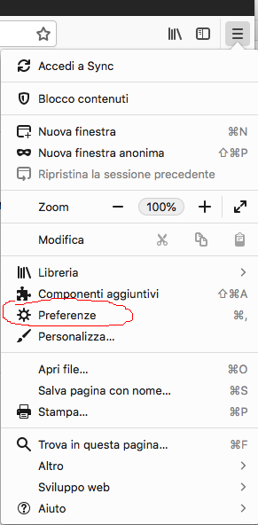
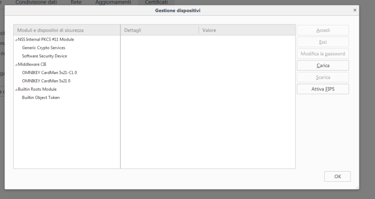
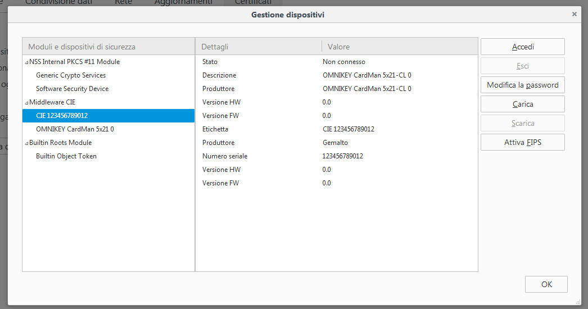
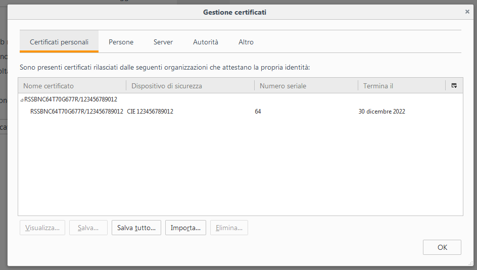
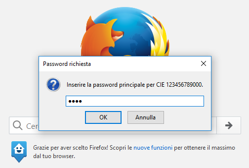

Firefox per MacOS
=================

Per utilizzare la CIE con il browser Firefox è necessario apportare a
quest’ultimo una configurazione diversa, attenendosi ai passi
sottostanti.

Accedere alla sezione “Preferenze” del browser:

|image39|

Figura 39. Preferenze Firefox

Selezionare la scheda “Privacy e Sicurezza”

|image40|

Figura 40. Preferenze Firefox

Cliccare su “Dispositivi di sicurezza”.

|image41|

Figura 41. Dispositivi di sicurezza Firefox

Cliccare su “Carica” e inserire le seguenti informazioni:

-  Nome modulo: software CIE

-  Nome file modulo: /Library/ipzs/libcie-pkcs11.dylib

|image42|

Figura 42. Configurazione Software CIE su Firefox

Se è la prima volta che si utilizza la CIE, sarà necessario completare
preventivamente la procedura di prima registrazione riportata nel
paragrafo §5. Se tutto va a buon fine, il modulo comparirà nella lista
di sinistra, con l’elenco dei lettori di smart card installati sul
computer:

|image43|

Figura 43. Dispositivi di sicurezza CIE su Firefox e modulo CIE caricato correttamente.

Appoggiando la CIE sul lettore questa verrà riconosciuta dal browser e
verranno visualizzate delle informazioni.

|image44|

Figura 44. Accesso al dispositivo di sicurezza "CIE" su Firefox

Per verificare la corretta installazione tornare alla scheda “Avanzate”,
e, lasciando la CIE appoggiata sul lettore, cliccare su “Certificati”.
Verrà richiesto il PIN della CIE. Digitare le ultime 4 cifre del PIN e
premere su OK.

|image45|

Figura 45. Immissione del PIN su Firefox

Nella scheda “Certificati Personali” comparirà il certificato di
autenticazione dell’utente, riconoscibile dal codice fiscale.

|image46|

Figura 46. Certificato CIE utente su Firefox

La configurazione a questo punto è stata eseguita correttamente.
All’avvio successivo di Firefox non sarà necessario ripetere questa
operazione.

Per utilizzare la CIE nell’accesso ad un servizio erogato da una
Pubblica Amministrazione, appoggiare la carta sul lettore smart card e
digitare l’indirizzo del servizio a cui si vuole accedere nella barra
degli indirizzi del browser Firefox.

All’avvio della connessione verrà richiesto il PIN della CIE. Inserire
le ultime 4 cifre del PIN.

|image47|

Figura 47. Accesso ad un servizio, immissione del PIN

Verrà poi richiesto di selezionare il certificato da utilizzare per
l’autenticazione client. Selezionare il certificato CIE, riconoscibile
dal codice fiscale del titolare, e premere OK.

|image48|

Figura 48. Conferma del certificato

L’applicazione dovrebbe riconoscere correttamente l’utente e consentire
l’accesso al servizio desiderato.

Attenzione: nel caso in cui venga inserito un PIN errato o il PIN sia
bloccato, Firefox non restituisce alcun messaggio d’errore all’utente,
ma ripropone la finestra di inserimento PIN. Verificare accuratamente il
PIN inserito per evitare il blocco accidentale della CIE.

Consultare il paragrafo §9.3 Sblocco per ulteriori dettagli in merito
alla procedura di sblocco PIN.

.. |image40| image:: ../../_img/image42.png
   :width: 6.69306in
   :height: 4.94861in
.. |image41| image:: ../../_img/image43.png
   :width: 6.69306in
   :height: 3.58542in
.. |image42| image:: ../../_img/image44.png
   :width: 3.21695in
   :height: 1.42512in

.. |image45| image:: ../../_img/image47.png
   :width: 3.64583in
   :height: 1.57292in

.. |image48| image:: ../../_img/image50.png
   :width: 4.01042in
   :height: 4.54167in
