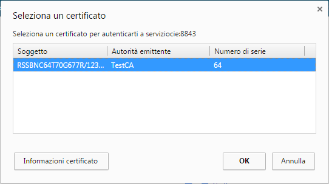
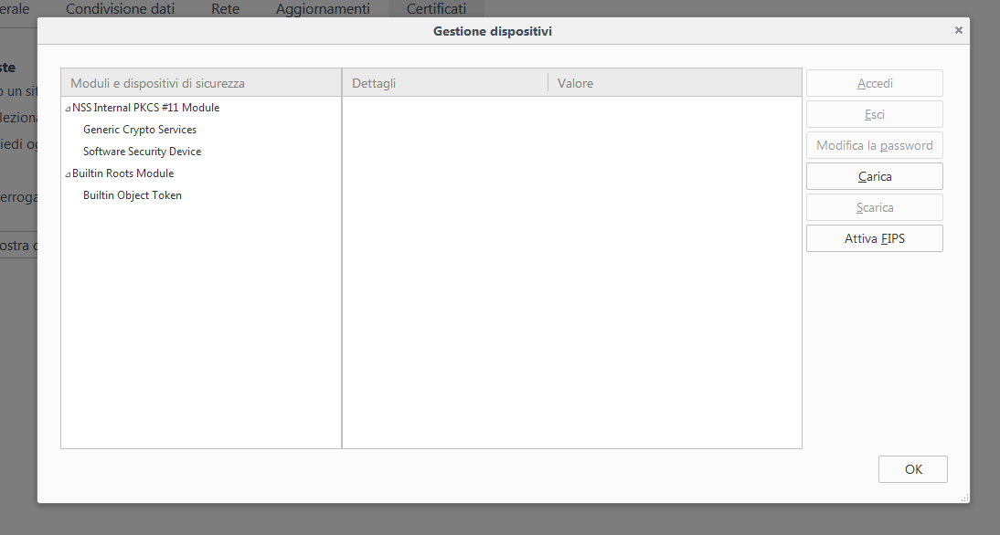
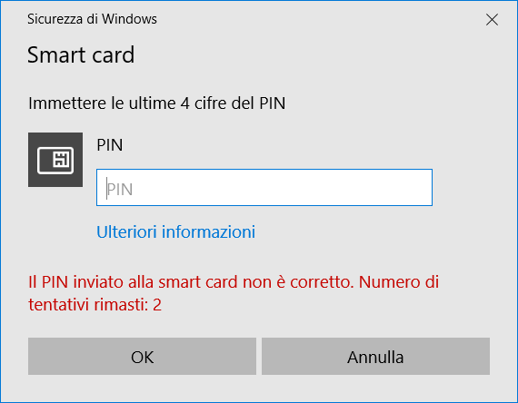
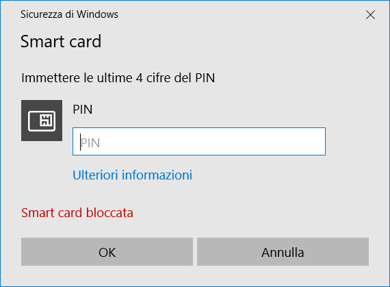
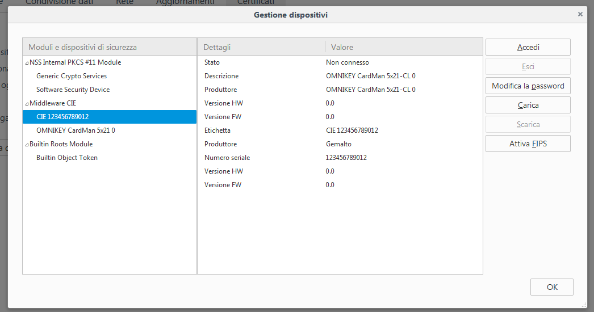

Utilizzo di MS Edge, Chrome e Opera su Windows
===================================

L’autenticazione tramite CIE su Edge, su Chrome e su Opera non richiede
alcuna operazione di configurazione aggiuntiva oltre all'abbinamento della carta.

Appoggiare la CIE sul lettore smart card e digitare l’indirizzo del
servizio a cui si vuole accedere nella barra degli indirizzi del
browser. Se è la prima volta che si procede all’utilizzo della CIE con
il browser, è necessario procedere all'esecuzione dell'abbinamento della CIE
secondo quanto descritto nel paragrafo §5. Nel
caso si sia già effettuata la procedura di primo utilizzo della CIE o
dopo averla in ogni caso completata, verrà richiesto quale certificato
utilizzare per l’autenticazione. Selezionare il certificato CIE,
riconoscibile dal codice fiscale del titolare, e premere OK.

|image19|

Figura 19. Accesso ai servizi digitali mediante la CIE, selezione del certificato

Su Chrome e Opera la finestra di selezione del certificato è la
seguente:

|image20|

Figura 20. Accesso ai servizi digitali mediante la CIE, conferma del certificato

Confermato il certificato da utilizzare, verrà richiesto di immettere il
PIN della CIE.

|image21|

Figura 21. Immissione delle ultime quattro cifre del PIN

Digitare **le ultime 4 cifre del PIN**, premere su OK e attendere
qualche secondo (la finestra di richiesta PIN non scompare
immediatamente). L’applicazione dovrebbe riconoscere correttamente
l’utente e consentire l’accesso al servizio.

Nel caso in cui venga inserito un PIN errato viene visualizzata una
finestra di errore in cui è specificato il numero rimanente di tentativi
di inserimento PIN prima del blocco:

|image22|

Figura 22. Nel caso in cui il PIN immesso non sia corretto

Se il PIN viene digitato in modo errato per 3 volte consecutive
quest’ultimo viene bloccato per motivi di sicurezza.

|image23|

Figura 23. CIE bloccata.

In tal caso, è possibile procedere al suo sblocco utilizzando il PUK e
cliccando sull’avviso che compare nell’area di notifica in basso a
destra.

|image24|

Figura 24. Sblocco della CIE

Consultare il paragrafo §9.3 Sblocco per ulteriori dettagli in merito
alla procedura di sblocco PIN.

.. |image19| image:: ../../_img/image21.png
   :width: 3.34646in
   :height: 2.64093in

