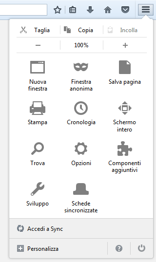
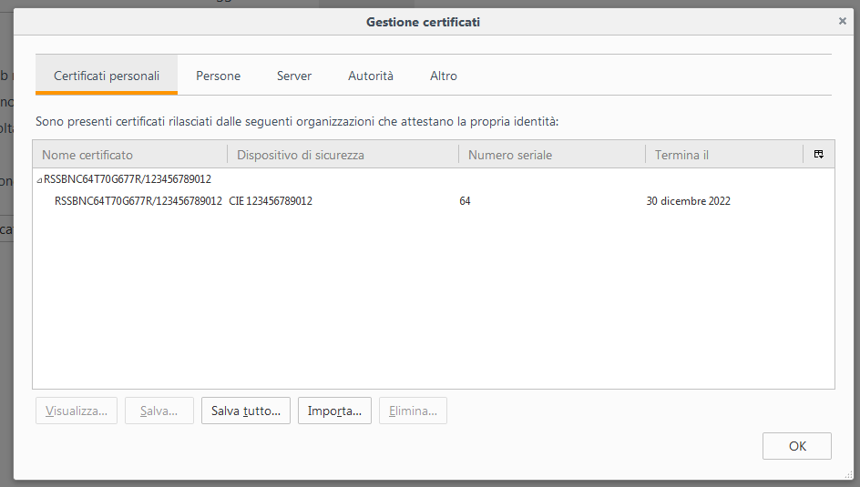
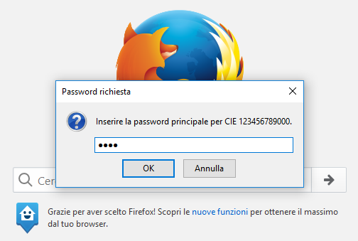

Firefox per Windows
===================

Per utilizzare la CIE su Windows con il browser Firefox, nel caso in cui
la versione di quest’ultimo sia inferiore o uguale alla v.90.x è
necessario apportare a quest’ultimo una configurazione aggiuntiva,
attenendosi ai passi sottostanti.

Tale configurazione **non è necessaria** con versioni successive alla
v.90.

Accedere alla sezione “Opzioni” del browser:

|image25|

Figura 25. Configurazione di Firefox

Selezionare la scheda “Avanzate”, quindi la scheda “Certificati”

|image26|

Figura 26. Configurazione di Firefox

Cliccare su “Dispositivi di sicurezza”.

|image27|

Figura 27. Aggiunta di un nuovo dispositivo di sicurezza su Firefox

Cliccare su “Carica” e inserire le seguenti informazioni:

-  Nome modulo: Software CIE

-  Nome file modulo: C:\Windows\System32\CIEPKI.dll

|image28|

Figura 28. Configurazione di un dispositivo di sicurezza su Firefox.

Se è la prima volta che si utilizza la CIE, verrà richiesto di
completare la procedura di prima registrazione riportata nel paragrafo
§5. Se tutto va a buon fine, il modulo comparirà nella lista di
sinistra, con l’elenco dei lettori di smart card installati sul
computer:

|image29|

Figura 29. Configurazione di un dispositivo di sicurezza su Firefox

Appoggiando la CIE sul lettore questa verrà riconosciuta dal browser e
verranno visualizzate delle informazioni.

|image30|

Figura 30. Configurazione di un dispositivo di sicurezza su Firefox e modulo CIE configurato correttamente

Per verificare la corretta installazione tornare alla scheda “Avanzate”,
e, lasciando la CIE appoggiata sul lettore, cliccare su “Certificati”.
Verrà richiesto il PIN della CIE. Digitare le ultime 4 cifre del PIN e
premere su OK.

|image31|

Figura 31. Accesso al dispositivo di sicurezza CIE configurato su Firefox

Nella scheda “Certificati Personali” comparirà il certificato di
autenticazione dell’utente, riconoscibile dal codice fiscale.

|image32|

Figura 32. Accesso al dispositivo di sicurezza configurato su Firefox

La configurazione a questo punto è stata eseguita correttamente.
All’avvio successivo di Firefox non sarà necessario ripetere questa
operazione.

Per utilizzare la CIE nell’accesso ad un servizio erogato da una
Pubblica Amministrazione, appoggiare la carta sul lettore smart card e
digitare l’indirizzo del servizio a cui si vuole accedere nella barra
degli indirizzi del browser Firefox.

All’avvio della connessione verrà richiesto il PIN della CIE. Inserire
le ultime 4 cifre del PIN.

|image33|

Figura 33. Accesso ad un servizio in rete con la CIE da Firefox

Verrà poi richiesto quale certificato utilizzare per l’autenticazione
client. Selezionare il certificato CIE, riconoscibile dal codice fiscale
del titolare, e premere OK.

|image34|

Figura 34. Accesso ad un servizio in rete da Firefox, selezione del
certificato

L’applicazione dovrebbe riconoscere correttamente l’utente e consentire
l’accesso al servizio desiderato.

Attenzione: nel caso in cui venga inserito un PIN errato o il PIN sia
bloccato, Firefox non restituisce alcun messaggio d’errore all’utente,
ma ripropone la finestra di inserimento PIN. Verificare accuratamente il
PIN inserito per evitare il blocco di quest'ultimo.

Consultare il paragrafo §9.3 Sblocco per ulteriori dettagli in merito
alla procedura di sblocco PIN.

.. |image26| image:: ../../_img/image28.png
   :width: 6.69306in
   :height: 2.51667in
.. |image27| image:: ../../_img/image29.png
   :width: 6.69306in
   :height: 3.41667in
.. |image28| image:: ../../_img/image30.png
   :width: 3.14961in
   :height: 1.45563in
.. |image29| image:: ../../_img/image31.png
   :width: 6.69306in
   :height: 3.55486in
.. |image30| image:: ../../_img/image32.png
   :width: 6.69306in
   :height: 3.51944in
.. |image31| image:: ../../_img/image33.png
   :width: 3.14961in
   :height: 1.35883in

.. |image34| image:: ../../_img/image36.png
   :width: 2.90278in
   :height: 3.2873in
