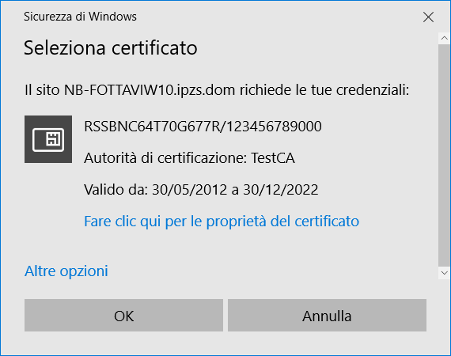
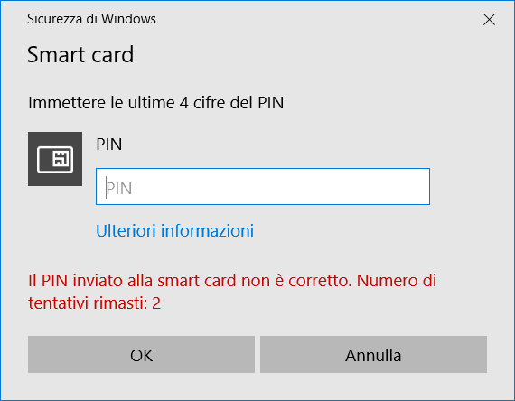
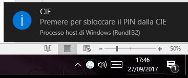

Firefox
=======

Per utilizzare la CIE con il browser Firefox è necessario apportare a
quest'ultimo una configurazione diversa, attenendosi ai passi
sottostanti.

Accedere alla sezione "Opzioni" del browser:

|image0|

Selezionare la scheda "Avanzate", quindi la scheda "Certificati"

|image1|

Cliccare su "Dispositivi di sicurezza".

|image2|

Cliccare su "Carica" e inserire le seguenti informazioni:

-  Nome modulo: Middleware CIE

-  Nome file modulo: C:\Windows\System32\CIEPKI.dll

|image3|

Se è la prima volta che si utilizza la CIE, verrà richiesto di
completare la procedura di prima registrazione riportata nel paragrafo "`Primo utilizzo della CIE con il Middleware`_"
. Se tutto va a buon fine, il modulo comparirà nella lista di sinistra,
con l'elenco dei lettori di smart card installati sul computer:

|image4|

Appoggiando la CIE sul lettore questa verrà riconosciuta dal browser e
verranno visualizzate delle informazioni.

|image5|

Per verificare la corretta installazione tornare alla scheda "Avanzate",
e, lasciando la CIE appoggiata sul lettore, cliccare su "Certificati".
Verrà richiesto il PIN della CIE. Digitare le ultime 4 cifre del PIN e
premere su OK.

|image6|

Nella scheda "Certificati Personali" comparirà il certificato di
autenticazione dell'utente, riconoscibile dal codice fiscale.

|image7|

La configurazione a questo punto è stata eseguita correttamente.
All'avvio successivo di Firefox non sarà necessario ripetere questa
operazione.

Per utilizzare la CIE nell'accesso ad un servizio erogato da una
Pubblica Amministrazione, appoggiare la carta sul lettore smart card e
digitare l'indirizzo del servizio a cui si vuole accedere nella barra
degli indirizzi del browser Firefox.

All'avvio della connessione verrà richiesto il PIN della CIE. Inserire
le ultime 4 cifre del PIN.

|image8|

Verrà poi richiesto quale certificato utilizzare per l'autenticazione
client. Selezionare il certificato CIE, riconoscibile dal codice fiscale
del titolare, e premere OK.

|image9|

L'applicazione dovrebbe riconoscere correttamente l'utente e consentire
l'accesso al servizio desiderato.

Attenzione: nel caso in cui venga inserito un PIN errato o il PIN sia
bloccato, Firefox non restituisce alcun messaggio d'errore all'utente,
ma ripropone la finestra di inserimento PIN. Verificare accuratamente il
PIN inserito per evitare il blocco accidentale della CIE.

Consultare il paragrafo "Sblocco_" per ulteriori dettagli in merito
alla procedura di sblocco PIN.

.. _`Primo utilizzo della CIE con il Middleware`: ../primo-utilizzo-della-cie-con-il-middleware.html
.. _Sblocco: ../gestione-del-pin-utente/sblocco.html

.. |image1| image:: ../_img/image22.png
   :width: 6.69306in
   :height: 2.74931in
.. |image2| image:: ../_img/image23.png
   :width: 6.69306in
   :height: 3.58542in

.. |image4| image:: ../_img/image25.png
   :width: 6.69306in
   :height: 3.55486in

.. |image6| image:: ../_img/image27.png
   :width: 3.64583in
   :height: 1.57292in
.. |image7| image:: ../_img/image28.png
   :width: 6.69306in
   :height: 3.79306in
.. |image8| image:: ../_img/image29.png
   :width: 5.24653in
   :height: 3.53264in
.. |image9| image:: ../_img/image30.png
   :width: 4.01042in
   :height: 4.54167in
