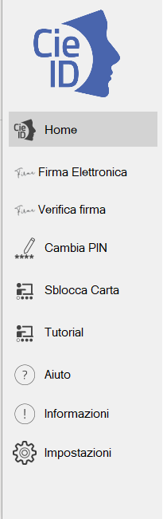

MS Internet Explorer, MS Edge, Chrome e Opera
=============================================

L'autenticazione tramite CIE su Internet Explorer (fino alla versione 11
e Edge), su Chrome e su Opera non richiede alcuna operazione di
configurazione aggiuntiva a quanto descritto nei paragrafi precedenti.

Appoggiare la CIE sul lettore smart card e digitare l'indirizzo del
servizio a cui si vuole accedere nella barra degli indirizzi del
browser. Se è la prima volta che si procede all'utilizzo della CIE con
il browser, verrà avviata la procedura descritta nel paragrafo "`Primo utilizzo della CIE con il Middleware`_". Nel
caso si sia già effettuata la procedura di primo utilizzo della CIE o
dopo averla in ogni caso completata, verrà richiesto quale certificato
utilizzare per l'autenticazione. Selezionare il certificato CIE,
riconoscibile dal codice fiscale del titolare, e premere OK.

|image0|

Su Chrome e Opera la finestra di selezione del certificato è la
seguente:

|image1|

Confermato il certificato da utilizzare, verrà richiesto di immettere il
PIN della CIE.

|image2|

Digitare le ultime 4 cifre del PIN, premere su OK e attendere qualche
secondo (la finestra di richiesta PIN non scompare immediatamente).
L'applicazione dovrebbe riconoscere correttamente l'utente e consentire
l'accesso al servizio.

Nel caso in cui venga inserito un PIN errato viene visualizzata una
finestra di errore in cui è specificato il numero rimanente di tentativi
di inserimento PIN primo del blocco:

|image3|

Se il PIN viene sbagliato per 3 volte consecutive quest'ultimo viene
bloccato per sicurezza.

|image4|

In tal caso, è possibile procedere al suo sblocco utilizzando il PUK e
cliccando sull'avviso che compare nell'area di notifica in basso a
destra.

|image5|

Consultare il paragrafo "Sblocco_" per ulteriori dettagli in merito
alla procedura di sblocco PIN.

.. _`Primo utilizzo della CIE con il Middleware`: ../primo-utilizzo-della-cie-con-il-middleware.html
.. _Sblocco: ../gestione-del-pin-utente/sblocco.html
.. |image0| image:: ../_img/image15.png
   :width: 5.28898in
   :height: 4.17391in
.. |image1| image:: ../_img/image16.png
   :width: 5.64583in
   :height: 3.16667in

.. |image3| image:: ../_img/image18.png
   :width: 4in
   :height: 3.11406in

.. |image5| image:: ../_img/image20.png
   :width: 3.8125in
   :height: 1.60417in
