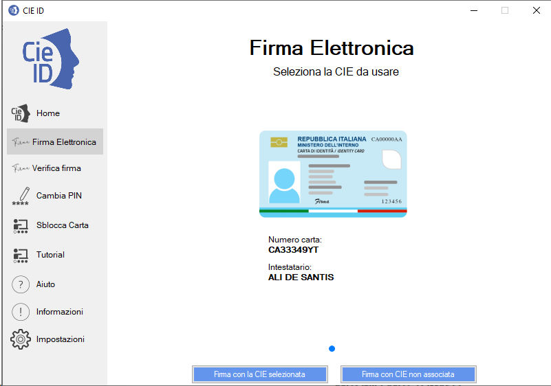
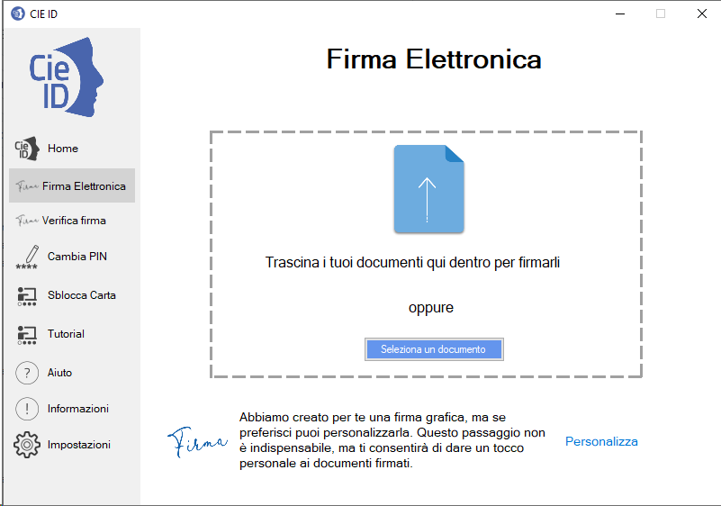
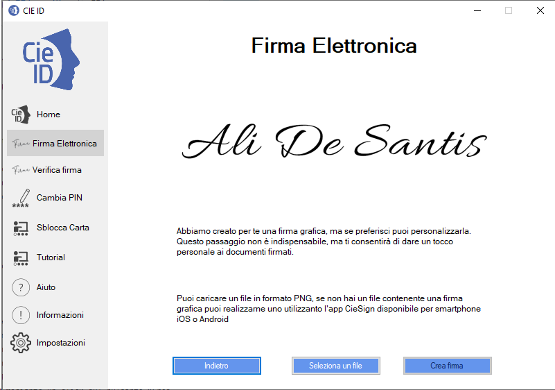
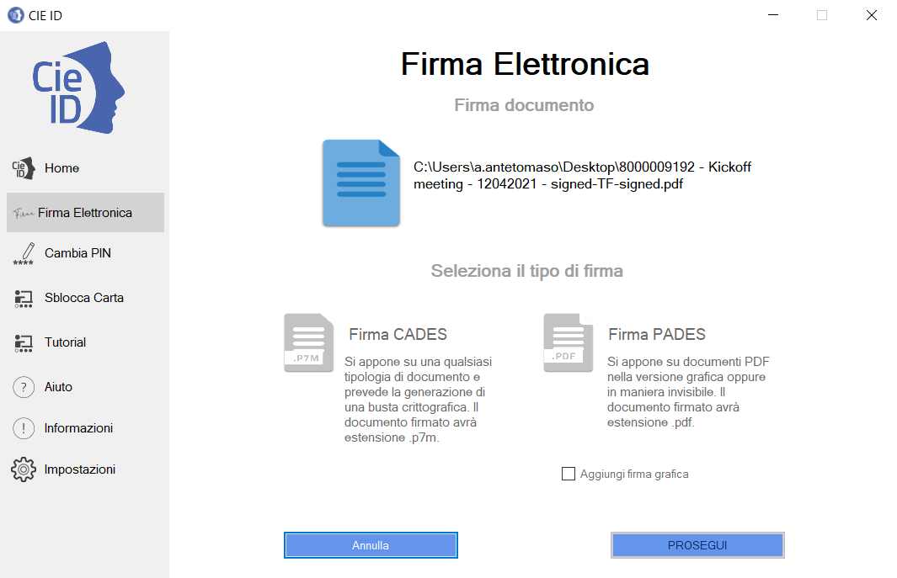

Calcolo della FEA
=================

Per firmare digitalmente un documento con la CIE occorre richiamare la funzione “Firma
Elettronica” nel menu di sinistra e procedere alla selezione di una
delle CIE abbinate da utilizzare, è anche possibile firmare con una CIE non associata.

|image59|

Figura 58. Home page della funzionalità di firma elettronica

Cliccare sul tasto “Seleziona” per proseguire con la seguente schermata.

|image60|

Figura 59. Selezione del documento e personalizzazione della firma

Prima di procedere è consigliabile modificare l’immagine della propria
firma autografa o prendere visione di quella di default generata
dall’applicativo. Per fare questo, cliccare su “Personalizza” in basso a
destra.

|image61|

Figura 60. Modifica dell'immagine della firma autografa

L’applicazione mostra l’immagine della firma autografa generata a
partire dal nome e dal cognome della CIE selezionata per il processo di
firma. È possibile caricare un’immagine da un file in formato PNG,
contenente l’immagine della propria firma autografa, elaborato usando uno
strumento di terze parti. Per fare questo, cliccare “Seleziona un file” e
procedere a selezionare il file PNG d’interesse. Nel caso in cui il
risultato non sia soddisfacente, mediante un click sul pulsante “Crea
firma” è possibile ripristinare l’immagine calcolata automaticamente da
CIE ID.

Per procedere quindi con l’apposizione della firma, nella schermata
principale (figura 59) caricare un documento mediante il tasto
“Seleziona un documento” o trascinarlo all’interno dell’apposita area
tratteggiata.

|image62|

Figura 61. Firma o Verifica di un file firmato

Cliccare su Firma per proseguire con la scelta della tipologia di firma
elettronica da apporre.

|image63|

Figura 62. Selezione della tipologia di firma elettronica

Selezionare firma “CADES” se si intende produrre un file digitalmente
firmato con estensione “.p7m”. Tale modalità di firma è l’unica
possibile per file in un formato differente dal PDF.

|image64|

Figura 63. Firma CADES.

Selezionare firma “PADES” se si intende produrre un file PDF
digitalmente firmato ed inserire la spunta sul selettore “Aggiungi firma
grafica” per inserire all’interno di esso un elemento
grafico formato dall’immagine della propria firma autografa e dalla data
di firma.

|image65|

Figura 64. Firma PDF con elemento grafico

Nel caso in cui venga scelto di firmare in modalità PADES con elemento
grafico, l’applicazione mostra un’anteprima del PDF caricato e chiede di
posizionare la firma nel posto desiderato.

|image66|

Figura 65. Posizionamento dell'elemento grafico della firma

Cliccando su Prosegui viene richiesto di immettere le ultime quattro
cifre del PIN.

|image67|

Figura 66. Immissione delle ultime quattro cifre del PIN per la firma
elettronica

Viene quindi chiesto di scegliere dove salvare il file firmato. Viene
proposto, come nome di default, il medesimo nome del file origine con il
suffisso “-signed” ma l’utente ha la possibilità di modificarlo.

Bisogna a questo punto poggiare la CIE sul lettore e cliccare su
“Salva”. Il file firmato verrà correttamente generato e salvato nella
posizione indicata. Al termine verrà fornita la schermata seguente.

|image68|

Figura 67. Fine generazione firma elettronica

Nel caso in cui si decida di controfirmare un file digitalmente firmato,
la firma elettronica calcolata con la CIE verrà aggiunta all’elenco di
firme digitali presenti nel file.

.. |image66| image:: ../_img/image65.png
   :width: 3.16233in
   :height: 2.54306in

