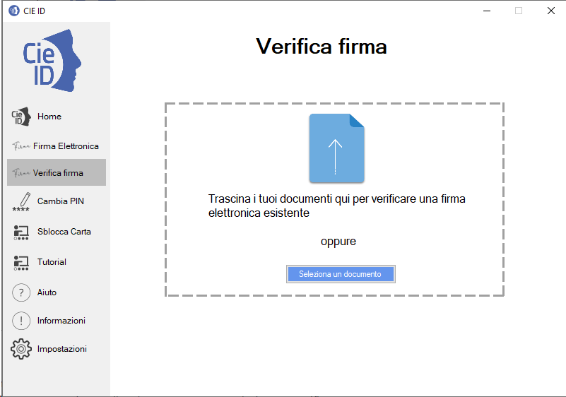
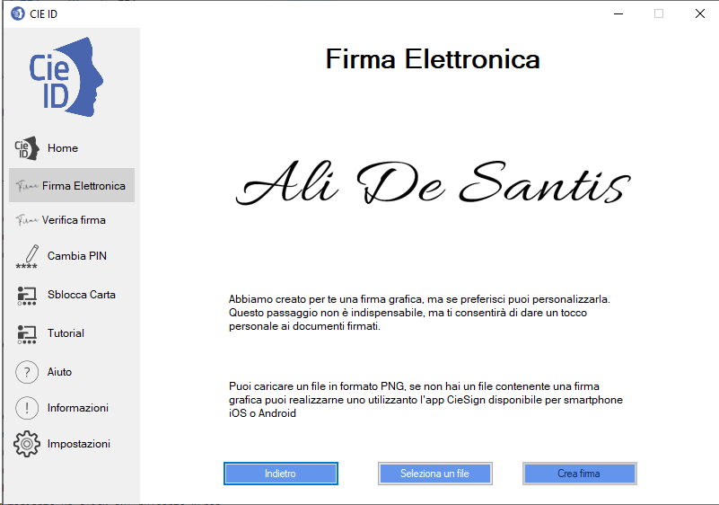
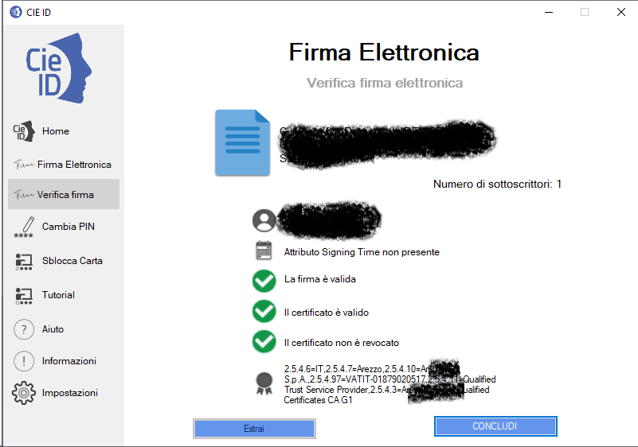

Verifica di un file digitalmente firmato
========================================

CIE ID consente di verificare un file digitalmente firmato con la CIE o
con un qualunque altro dispositivo di apposizione di  firma digitale
qualificata, nei formati CADES o PADES.

Utilizzare la funzione “Verifica firma” nel menu di sinistra per
accedere alla funzionalità. Tale funzionalità è utilizzabile anche
senza avere alcuna CIE abbinata.

|imageverifica1|

Figura 69. Verifica di un file firmato

Dalla schermata di "Verifica Firma" cliccare su "Seleziona un documento"
per caricare un documento digitalmente firmato o trascinarlo all’interno dell’apposita area tratteggiata.

L’applicazione procederà alla verifica del file firmato e del
certificato del firmatario, dal punto di vista della credibilità e dello
stato di revoca del medesimo.

Al termine fornirà l’esito dell’operazione in una apposita schermata.

|imageverifica2|

Figura 70. Esito della verifica della firma

Se è stata effettuata la verifica di un file p7m sarà possibile estrarre il file cliccando su "Estrai"

