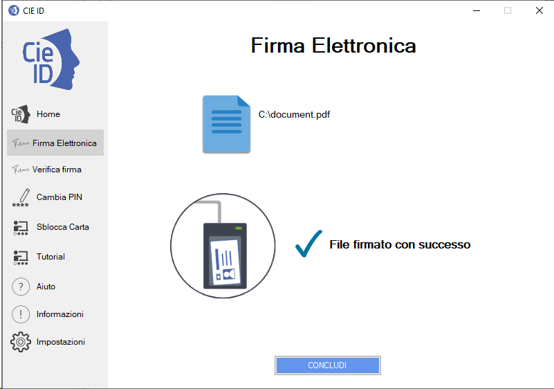

Verifica di un file digitalmente firmato
========================================

CIE ID consente di verificare un file digitalmente firmato con la CIE o
con un qualunque altro dispositivo di calcolo di una firma digitale
qualificata, nei formati CADES o PADES.

Utilizzare la funzione “Verifica firma” nel menu di sinistra per
accedere alla funzionalità.

Cliccare sul tasto “Seleziona” per proseguire con la seguente schermata.

|image69|

Figura 68. Selezione del documento e personalizzazione della firma

Caricare un documento digitalmente firmato mediante il tasto “Seleziona
un documento” o trascinarlo all’interno dell’apposita area tratteggiata.
Dalla schermata seguente selezionare “Verifica”.

|image70|

Figura 69. Firma o Verifica di un file firmato

L’applicazione procederà alla verifica del file firmato e del
certificato del firmatario, dal punto di vista della credibilità e dello
stato di revoca del medesimo.

Al termine fornirà l’esito dell’operazione in una apposita schermata.

|image71|

Figura 70. Esito della verifica della firma

.. |image69| image:: ../_img/image59.png
   :width: 3.29236in
   :height: 2.61768in
.. |image70| image:: ../_img/image61.png
   :width: 3.29163in
   :height: 2.61319in
