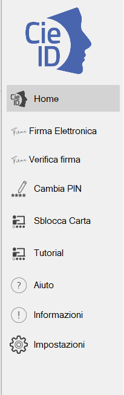

Funzionalità dell’applicazione
==============================

Sulla sinistra dell’applicazione è presente il menu di funzionalità
offerte:

|image16|

Figura 16. Funzionalità dell'applicazione CieID

Nel dettaglio:

1. **Home**: riporta alla finestra con le CIE abbinate

2. **Firma elettronica**: consente di generare una FEA mediante una
   delle CIE abbinate

3. **Verifica firma**: consente di verificare un file firmato
   digitalmente. Non occorre avere CIE abbinate per usare tale
   funzionalità

4. **Cambia PIN**: consente di cambiare il PIN di una CIE. Non occorre
   avere CIE abbinate per usare tale funzionalità

5. **Sblocca carta**: consente di reimpostare o sbloccare il PIN di una
   CIE mediante il PUK. Non occorre avere CIE abbinate per usare tale
   funzionalità

6. **Tutorial**: istruzioni su come si usa il Software CIE per accedere
   ai servizi in rete

7. **Aiuto**: istruzioni per richiedere assistenza

8. **Informazioni**: privacy policy del Software CIE

9. **Impostazioni**: consente di impostare il proxy per la verifica
   della firma e impostare il livello di log desiderato.

