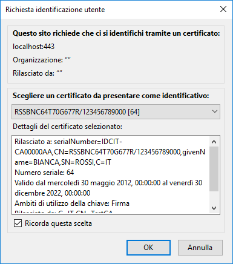
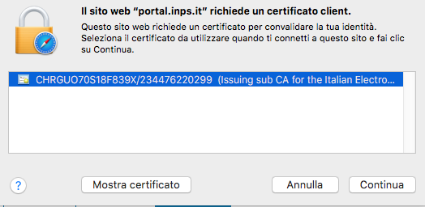

Cambio
======

Il PIN della CIE può essere modificato per intero (tutte e 8 le cifre)
con un nuovo PIN che il titolare può ricordare più facilmente.

Per cambiare il PIN appoggiare la CIE sul lettore di smart card e
selezionare Cambio PIN dal menu avvio:

|image0|

Inserire le ultime 4 cifre del PIN attuale della CIE e confermare
cliccando su OK.

|image1|

Inserire quindi le ultime 4 cifre del nuovo PIN e confermare.
Quest'ultimo deve essere digitato 2 volte per evitare che, a causa di
errori di digitazione, il PIN venga impostato ad un valore diverso da
quello desiderato:

|image2|

Nel caso in cui la seconda digitazione del PIN non corrisponda alla
prima l'applicazione si blocca con un avviso all'utente. Se il PIN
iniziale è invece digitato correttamente per due volte, avviene il
cambio e viene mostrata la finestra di conferma seguente.

|image3|

Se il PIN iniziale non corrisponde a quello digitato verrà visualizzata
una schermata di errore in cui è specificato il numero di tentativi
rimanenti prima di bloccare il PIN.

|image4|

In caso di blocco del PIN è necessario procedere allo sblocco tramite il
PUK. Consultare il paragrafo "Sblocco_" per ulteriori dettagli in
merito alla procedura di sblocco PIN.

.. _Sblocco: sblocco.html
.. |image0| image:: ../_img/image33.png
   :width: 2.42667in
   :height: 1.4in
.. |image1| image:: ../_img/image34.png
   :width: 4.6915in
   :height: 2.66019in
.. |image2| image:: ../_img/image35.png
   :width: 4.82524in
   :height: 2.78543in

