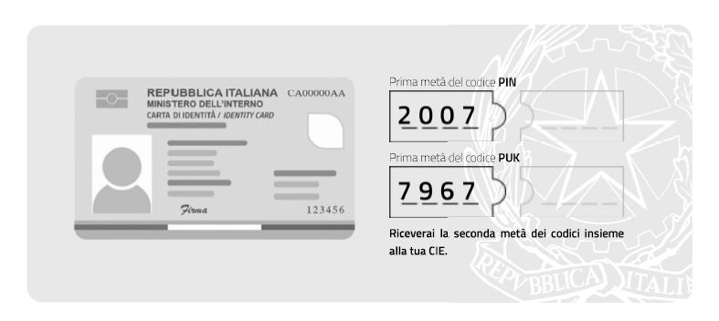
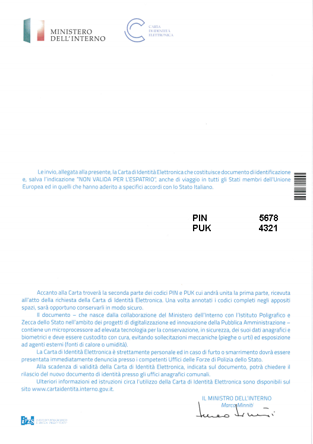

I codici PIN e PUK vengono comunicati al titolare della CIE in due
parti. La prima parte durante la richiesta del documento presso gli
uffici comunali. La seconda parte si trova sul foglio di accompagnamento
a cui è attaccata la CIE, all’interno della busta sigillata che il
cittadino riceve a casa o ritira al Comune.

Prima parte del PIN:

|image72|

Figura 71. Prima metà del PIN e del PUK nella ricevuta del Comune

Seconda parte del PIN:

|image73|

Figura 72. Seconda metà del PIN e del PUK nella lettera di
accompagnamento della CIE.

In questo caso il PIN completo è **12345678** e il PUK è **87654321**.

In seguito all’abilitazione verranno sempre richieste **solo le ultime 4
cifre del PIN**. Nel caso in esempio **5678.**

