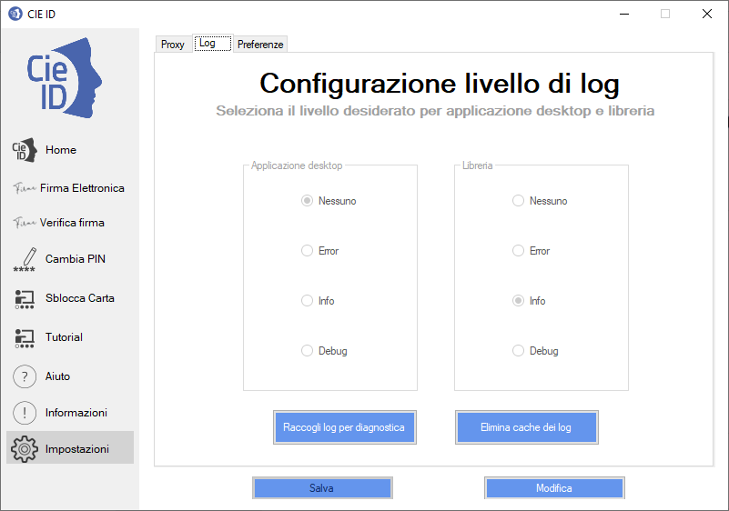

Log
===

In caso errori, è possibile abilitare la scrittura di un file di
diagnostica (file di log) di crescente livello di granularità. La
scrittura di tale file può essere attivata solo per l’applicazione CIE
ID, per la libreria CIEPKI.dll o per entrambe.

I files di log sono scritti nei seguenti percorsi:

-  Windows c:\%PROGRAMDATA%\CIEPKI.

-  MacOs – Linux
   ./Library/Containers/it.ipzs.CIE-ID.CIEIDToken/Data/.CIEPKI.

|image82|

Figura 81. Abilitazione della scrittura del log

