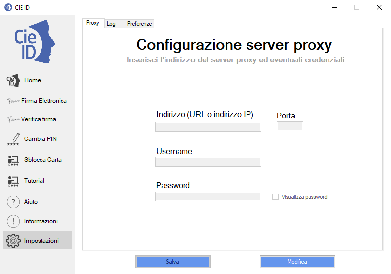

Proxy di rete
=============

Il servizio di verifica della firma richiede che il computer dell’utente
sia connesso in rete, di modo da verificare lo stato di revoca del certificato digitale a bordo della CIE.

Utilizzando la funzione “Impostazioni” è possibile specificare, laddove
presente, i parametri per l’utilizzo di un proxy di rete.

|image81|

Figura 80. Configurazione di un proxy per il servizio di verifica

