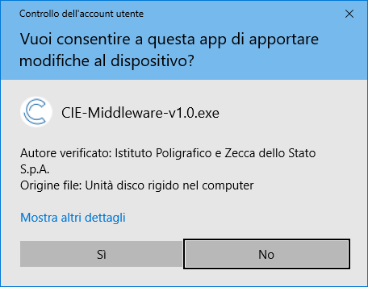
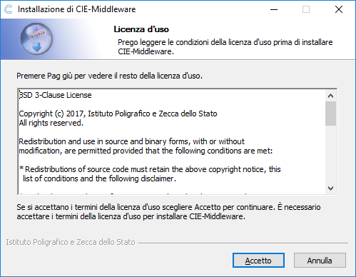
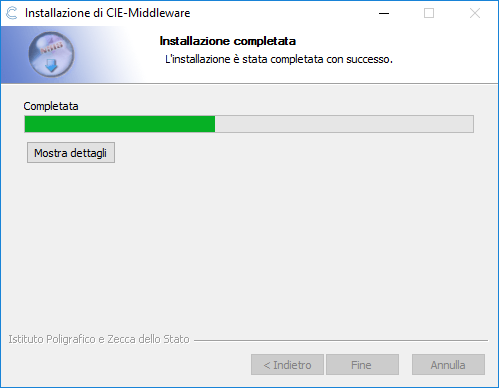
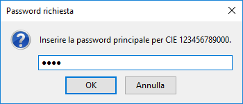
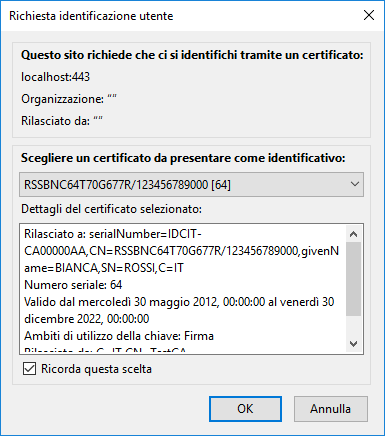
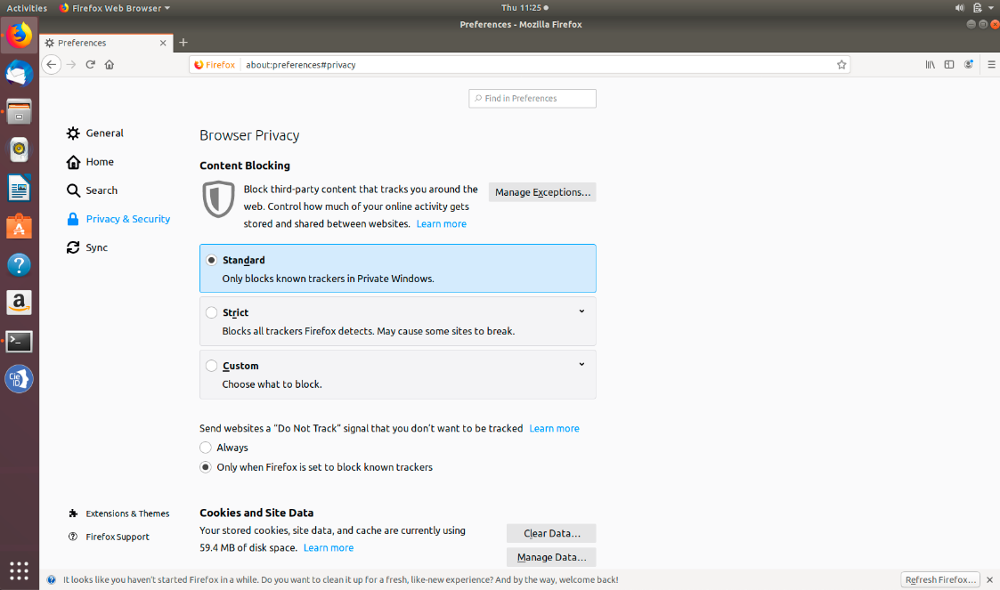

Installazione del Middleware CIE
================================

Installazione Windows
---------------------

Per installare il Software CIE è necessario disporre di un account con
privilegi di amministratore. Effettuare il download del middleware dal
Portale CIE,
`www.cartaidentita.interno.gov.it <http://www.cartaidentita.interno.gov.it>`__,
sezione "Servizi", sotto sezione "middleware cie" oppure dal sito
`developers.italia.it <https://developers.italia.it/>`__, sezione "CIE".

Effettuare un doppio click sul file “CIE-Software-<VERSIONE>.exe” scaricato. 
Nel caso sia abilitato il Controllo Account Utente (UAC) di Microsoft, verrà visualizzata 
la seguente schermata. È necessario cliccare su “SI”:

|image44|

Comparirà la seguente schermata:

|image45|

Cliccare sul tasto Accetto e attendere il completamento dell’installazione

|image46|

Cliccare su Fine per terminare l’installazione.

In seguito all'installazione sarà presente nel menu avvio un nuovo
gruppo di programmi chiamato "CIE Software":

|image47|

Installazione Mac OSX
---------------------

Per installare il Software CIE è necessario disporre di un account con
privilegi di amministratore. Effettuare il download del middleware dal
Portale CIE,
`www.cartaidentita.interno.gov.it <http://www.cartaidentita.interno.gov.it>`__,
sezione "Servizi", sotto sezione "middleware cie" oppure dal sito
`developers.italia.it <https://developers.italia.it/>`__, sezione “CIE” nel caso in cui si sia interessati alle ultime versioni “beta” del software o al codice sorgente.

Terminato il download del pacchetto, effettuare un doppio click sul file “CIE-software-<VERSIONE>.pkg” scaricato. 

Comparirà la seguente schermata: 

|image48|

Cliccare sul tasto “Continua”. Comparirà quindi la finestra di informazioni sul software della CIE che si sta installando. 

|image49|

Cliccare sul tasto “Continua” per proseguire nella sezione “Licenza”. 

|image50|

Leggere la licenza d’uso e Cliccare sul tasto “Continua”.

|image51|

Cliccare su “Accetta” per proseguire con l’installazione. 

|image52|

Il software deve necessariamente essere installato sull’hard disk principale, non è possibile scegliere un disco secondario/esterno. Cliccare quindi su “Continua” per proseguire.
Cliccare su “Installa” per completare il processo di installazione. A questo punto verrà richiesta la password di un utente amministratore. Inserire la password e premere su “Installa Software”.
Attendere il completamento dell’installazione, al termine della quale verrà mostrata la finestra di installazione riuscita.

|image53|

Cliccare su “Chiudi” per terminare l’installazione.

.. |image0| image:: _img/image1.png
   :width: 8.9999in
   :height: 1.32292in

.. |image4| image:: _img/image5.png
   :width: 5.19792in
   :height: 4.26042in
.. |image5| image:: _img/image6.png
   :width: 2.67708in
   :height: 1.57292in
.. |image44| image:: _img/image44.png
   :width: 2.67708in
   :height: 1.57292in
.. |image45| image:: _img/image45.png
   :width: 2.67708in
   :height: 1.57292in
.. |image46| image:: _img/image46.png
   :width: 2.67708in
   :height: 1.57292in

.. |image48| image:: _img/image48.png
   :width: 2.67708in
   :height: 1.57292in
.. |image49| image:: _img/image49.png
   :width: 2.67708in
   :height: 1.57292in

.. |image51| image:: _img/image51.png
   :width: 2.67708in
   :height: 1.57292in

.. |image53| image:: _img/image53.png
   :width: 2.67708in
   :height: 1.57292in