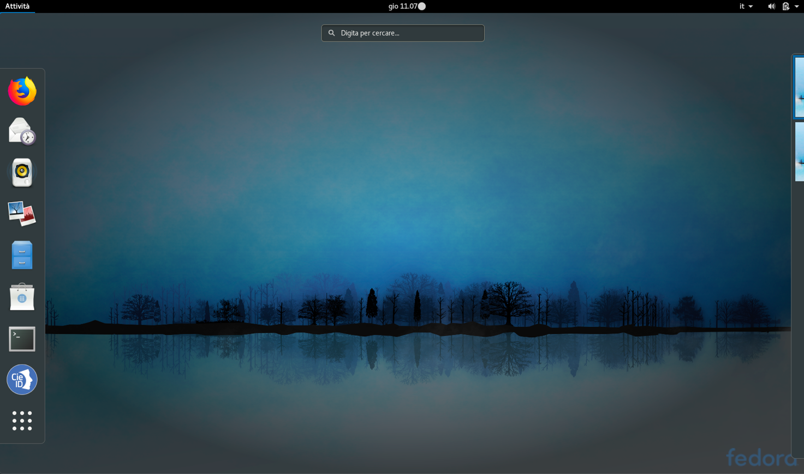

Distribuzioni “Red Hat based”
=============================

Nel caso di distribuzioni “Red Hat based” (ad es. Fedora Linux), occorre
scaricare il file cie-Software_<VERSIONE>.rpm (es.
cie-Software_1.1h_x86_64.rpm).

Effettuato il download, occorre aprire un terminale e digitare il
seguente comando, dopo essersi posizionati nella directory dove è stato
scaricato il pacchetto di installazione:

*sudo rpm -i <NOME_FILE>.rpm*

Verrà richiesto di inserire la password di root. Inserita la password e
premuto Invio, partirà la procedura di installazione che copierà i
seguenti files:

1. Cartella “CIEID” nel percorso /usr/share/

2. File “libcie-pkcs11.so” nel percorso /usr/local/lib/

3. File “CIE_ID”.desktop nel percorso /usr/share/applications/

Al termine comparirà l’icona di CIEID nella barra dei collegamenti
veloci, come mostrato nella schermata di seguito (che fa riferimento ad
una distribuzione “Fedora”).

|image12|

Figura 12 Software CIE su distribuzioni "Red Hat based"

