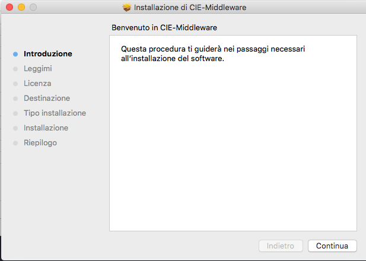
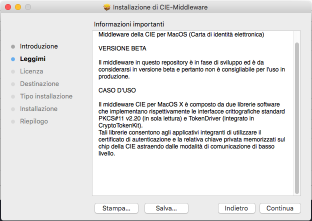
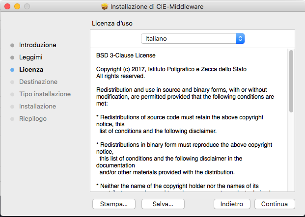

MacOS
=====

Per installare il Software CIE è necessario disporre di un account con
privilegi di amministratore. 

Dalla versione 1.4.3.5 è possibile installare il Software CIE collegandosi ad Apple Store ed effettuando la ricerca per "Software CIE".

|imageAPPStore|

Figura 5. Installazione del Software CIE su sistema MacOS

Nel caso in cui si desideri installare versioni precedenti, è possibile effettuare il download del Software dal `repository GitHub <https://github.com/italia/cie-middleware-macos>`_ di riferimento, avendo cura di scegliere 
accuratamente la versione di proprio interesse.

Terminato il download del pacchetto, effettuare un doppio click sul file
“CIE-software-<VERSIONE>.pkg” scaricato.

Comparirà la seguente schermata:

|image5|

Figura 6. Installazione del Software CIE su sistema MacOS

Cliccare sul tasto “Continua”. Comparirà quindi la finestra di
informazioni sul software della CIE che si sta installando.

|image6|

Figura 7. Installazione del Software CIE su sistema MacOS

Cliccare sul tasto “Continua” per proseguire nella sezione “Licenza”.

|image7|

Figura 8. Installazione del Software CIE su sistema MacOS

Leggere la licenza d’uso e Cliccare sul tasto “Continua”.

|image8|

Figura 9. Installazione del Software CIE su sistema MacOS

Cliccare su “Accetta” per proseguire con l’installazione.

|image9|

Figura 10. Installazione del Software CIE su sistema MacOS

Il software deve necessariamente essere installato sull’hard disk
principale, non è possibile scegliere un disco secondario/esterno.
Cliccare quindi su “Continua” per proseguire.

Cliccare su “Installa” per completare il processo di installazione. A
questo punto verrà richiesta la password di un utente amministratore.
Inserire la password e premere su “Installa Software”.

Attendere il completamento dell’installazione, al termine della quale
verrà mostrata la finestra di installazione riuscita.

|image10|

Figura 11. Conclusione installazione del Software CIE MacOS

Cliccare su “Chiudi” per terminare l’installazione.

.. |image8| image:: ../_img/image9.png
   :width: 5.17545in
   :height: 3.65032in
.. |image9| image:: ../_img/image10.png
   :width: 5.17545in
   :height: 3.67532in
.. |image10| image:: ../_img/image11.png
   :width: 5.14776in
   :height: 3.66667in

