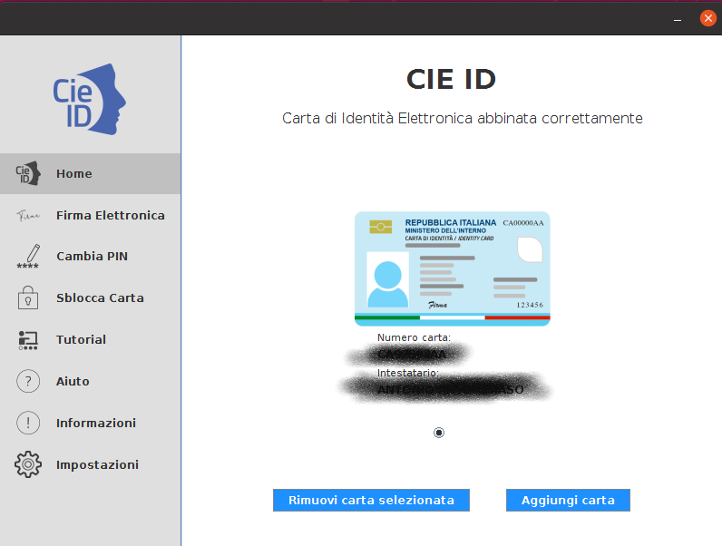

Primo utilizzo della CIE
========================

Al primo utilizzo di una CIE, l'applicazione “CIE ID” richiede che venga effettuato un
processo di abbinamento/verifica per assicurare che la carta che si intende adoperare sia valida e i dati
contenuti in essa siano corretti. Questo processo viene eseguito solo
una volta e richiede che sia inserito il PIN per esteso (tutte e 8 le cifre).

La procedura viene avviata lanciando l’app “CIE ID”. Viene presentata
una schermata come quella di seguito. Lasciando la CIE posizionata sul
lettore, digitare il PIN e premere “Abbina”.

|image17|

Figura 18. Abbinamento di una CIE

Appoggiando la CIE sul lettore di smart card collegato alla postazione,
digitando il PIN e selezionando il tasto “abbina” si avvia la procedura.

|WARNING| **Attenzione! In fase di
abilitazione verranno richieste tutte le 8 cifre del PIN.
Successivamente, durante il normale utilizzo sarà necessario inserire
solo le ultime 4 cifre.**

Al termine della procedura, la CIE sarà
abilitata all’uso e verrà visualizzato il messaggio di CIE abilitata.
Cliccare su “Concludi” per terminare.

La sezione “Home” ora visualizzerà le informazioni della CIE appena
associata:

|image18|

Figura 19. Schermata Home di CIE ID con indicazione della CIE abbinata

È possibile ripetere l’operazione per altre carte,
di modo da poter utilizzare una medesima postazione di lavoro con più
CIE, secondo le necessità (es. tutte le CIE del nucleo familiare).

.. |image17| image:: _img/image18.png
   :width: 4.93126in
   :height: 4.46596in
.. |WARNING| image:: _img/image19.png
   :width: 0.36458in
   :height: 0.3125in

