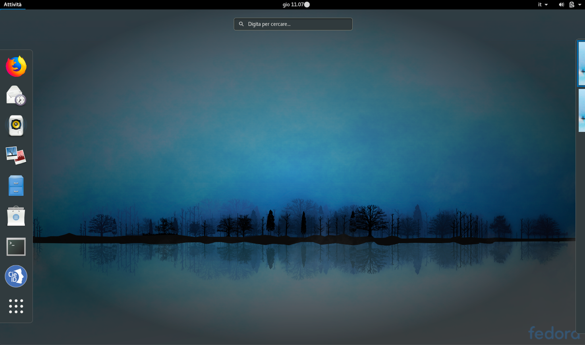

Primo utilizzo della CIE con il Middleware
==========================================

Al primo utilizzo di una CIE, "CIE Middleware" richiede di effettuare un
processo di verifica per assicurarsi che la carta sia valida e i dati
contenuti in essa siano corretti. Questo processo viene eseguito solo
una volta; al successivo utilizzo non sarà necessario ripetere questa
operazione. Durante il processo è necessario inserire il PIN per esteso.

La procedura viene avviata la prima volta che si tenta di utilizzare la
CIE per autenticarsi ad un servizio in rete attraverso il browser. Viene
presentata una schermata come quella di seguito. Lasciando la CIE
posizionata sul lettore, premere OK.

.. _section-1:

|image0|

Viene richiesto di digitare il PIN. Procedere e premere OK.

|image1|

|image2| **Attenzione! In fase di
abilitazione verranno richieste tutte le 8 cifre del PIN.
Successivamente, durante il normale utilizzo sarà necessario inserire
solo le ultime 4 cifre.**

Viene quindi avviata la procedura di controllo e validazione e viene
mostrata la schermata in figura:

|image3|

Al termine, la CIE sarà abilitata all'uso e verrà visualizzata la
seguente schermata. Cliccare su OK per terminare.

|image4|

.. _section-2:

.. |image0| image:: _img/image10.png
   :width: 4.85417in
   :height: 2.8125in
.. |image1| image:: _img/image11.png
   :width: 4.85417in
   :height: 2.8125in

.. |image4| image:: _img/image14.png
   :width: 4.85417in
   :height: 2.8125in
