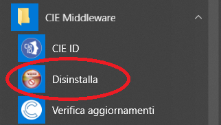
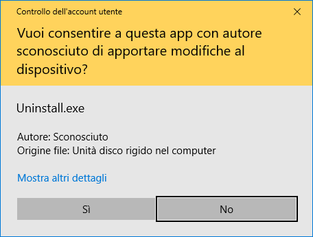

Windows
=======

Per rimuovere il Software CIE è necessario utilizzare un
account amministratore.

Selezionare il collegamento "Disinstalla" nel menu "CIE Middleware"

|image13|

Figura 14. Voce per la disinstallazione del Software CIE in ambiente Windows

Nel caso sia abilitato il Controllo Account Utente (UAC) varrà
visualizzata la seguente schermata. Confermare cliccando su “Si”.

|image14|

Figura 15. Disinstallazione del Software CIE Win

Confermare la rimozione cliccando su “Disinstalla”:

|image15|

Figura 16. Disinstallazione del Software CIE Win

Attendere il termine della rimozione.

Al medesimo risultato si può arrivare selezionando "Disinstalla" in corrispondenza
voce "CIE Middleware" nel pannello di Windows "App e funzionalità".

.. |image15| image:: ../_img/image16.png
   :width: 3.93701in
   :height: 3.06087in
